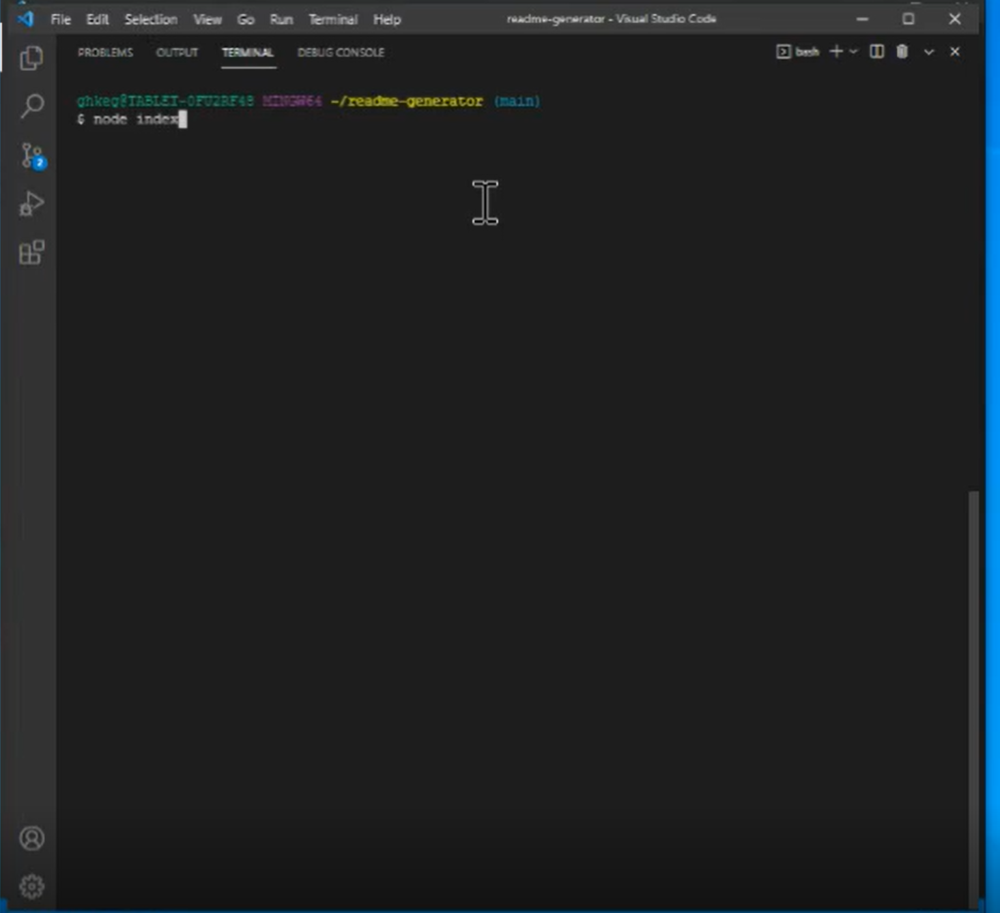

# Crypto Bot

## Author
Garrett Kegel

## Description
This bot does not make any money. I wish it did.
  
## Table of Contents

[Author](#author)

[Description](#description)

[Table of Contents](#table-of-contents)

[Installation](#installation)

[Usage](#usage)

[License](#license)

[Contributing](#contributing)

[Tests](#tests)

[Questions](#questions)
  
## Installation
Install this application.

## Usage
Use this application.

## License
This Source Code Form is subject to the terms of the Mozilla Public License, v. 2.0. If a copy of the MPL was not distributed with this file, You can obtain one at https://mozilla.org/MPL/2.0/.

## Contributing
Garrett Kegel

## Tests
No tests.

## Questions

Contact the developer and owner of this repository by using the information below : 

GitHub
https://github.com/eigenvalue000

Email
qwxzjkv20946137@gmail.com

